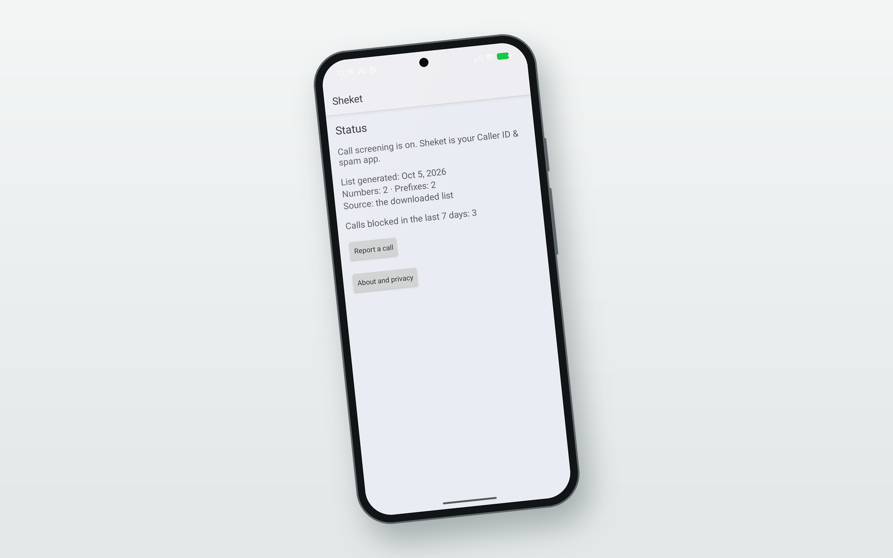

  <picture>
    <source media="(prefers-color-scheme: dark)" srcset="assets/brand/logo-dark.png">
    
  </picture>

  An election spam blocker for Israel: Android and iOS apps fed by a shared, user-reported blocklist.

  
  
  
  
  

  
   
  Sheket on Android — status screen, real emulator capture

Sheket (Hebrew שקט, "quiet") blocks election calls and, on iOS, junk election
SMS. Section 30A of the Communications Law does not cover election
propaganda, so Sheket stops it on the phone instead.

## What it does

- **Android:** a `CallScreeningService` rejects calls from listed numbers and
  prefixes before they ring, deciding against a local copy of the list.
- **iOS:** a Call Directory extension blocks listed numbers, and a Message
  Filter extension moves election SMS to the Junk tab.
- **Shared blocklist:** users report what they receive from inside the app,
  and a sender is listed only when several independent reporters agree.

## How it works

A user reports a call or SMS from the app, and the report Lambda validates it,
rate-limits it and stores it. Every 15 minutes the aggregate Lambda publishes a
sender to `v1/blocklist.json` once, within the last 7 days, at least 3 distinct
installs on at least 2 distinct /24 networks have reported it, merges the
curated rules in `contract/curated.json`, and drops anything on the operator's
`never_block` list (emergency and service numbers, the Central Elections
Committee, banks, health funds, common 2FA senders). The apps download the list
from CloudFront and block on the device: no call or message is sent to the
server to be judged. The full design is in [`docs/spec.md`](docs/spec.md).

## Privacy

There are no accounts. A report carries a random install ID (not tied to a
person, phone number or advertising ID), the reported sender, and the message
text only if the user ticks "include the message text". The server keeps a
salted hash of the reporter's /24 network, not the raw IP address, and every
report expires after 30 days. Spec section 6.2 has the full list of stored
fields.

## Repository

| Path | What it is |
|---|---|
| `docs/spec.md` | The product spec. Binding. |
| `contract/` | The blocklist schema, curated rules and shared test corpus. The acceptance tests for every track. |
| `AGENTS.md` | Rules for anyone, human or agent, changing this repository. |
| `backend/` | Python 3.13 Lambda code (report and aggregate) and its tests. |
| `infra/` | Terraform root module. Its packaging copies `contract/curated.json` and `contract/blocklist.schema.json` into the Lambda package. |
| `android/` | Kotlin app, min SDK 29. |
| `ios/` | Swift app and extensions, iOS 16+, with matching logic in `ios/SheketCore`. |

## Build & run

CI runs one workflow per track in `.github/workflows/`, and each workflow is
the reference for building and testing its track:

| Track | Workflow | Commands (from the workflow) |
|---|---|---|
| backend | [`backend.yml`](.github/workflows/backend.yml) | `backend/`: `python -m pytest -q` (Python 3.13); `infra/`: `terraform fmt -check -recursive`, `terraform validate`, `terraform test` |
| android | [`android.yml`](.github/workflows/android.yml) | `android/`: `./gradlew testDebugUnitTest` (JDK 17) |
| ios | [`ios.yml`](.github/workflows/ios.yml) | `ios/SheketCore/`: `swift test` |

A change to `contract/` runs all three. The on-device checks for Android call
screening are in [`android/docs/manual-test.md`](android/docs/manual-test.md),
and the contract files are described in [`contract/README.md`](contract/README.md).
`terraform apply` is a human action; see `AGENTS.md`.
